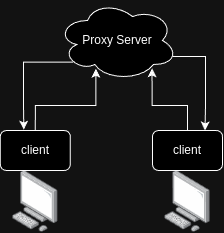

# GopherProxy 

Simple two way TCP proxy over WebSockets. This proxy allows you 
to connect to remote systems that normally do not have direct connectivity between them. 

Why make this instead of using something off the shelf?
Because FUNNNNNN!

## Topology
The setup is pretty simple. Bot clients connect to 
the central proxy server, operating in an in-out mode. 
Then the proxy server simply relays the data between the two clients.
depending on the configuration of each client (what ports to forward)




## Development 

Starting the development environment is simple, assuming `Docker` is already installed simply run:
```bash
./dev.sh
```